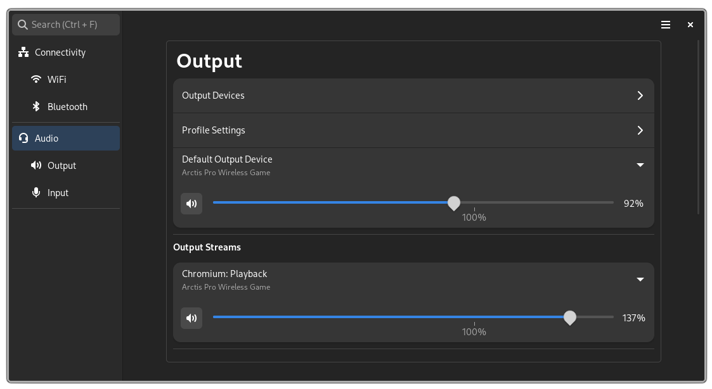
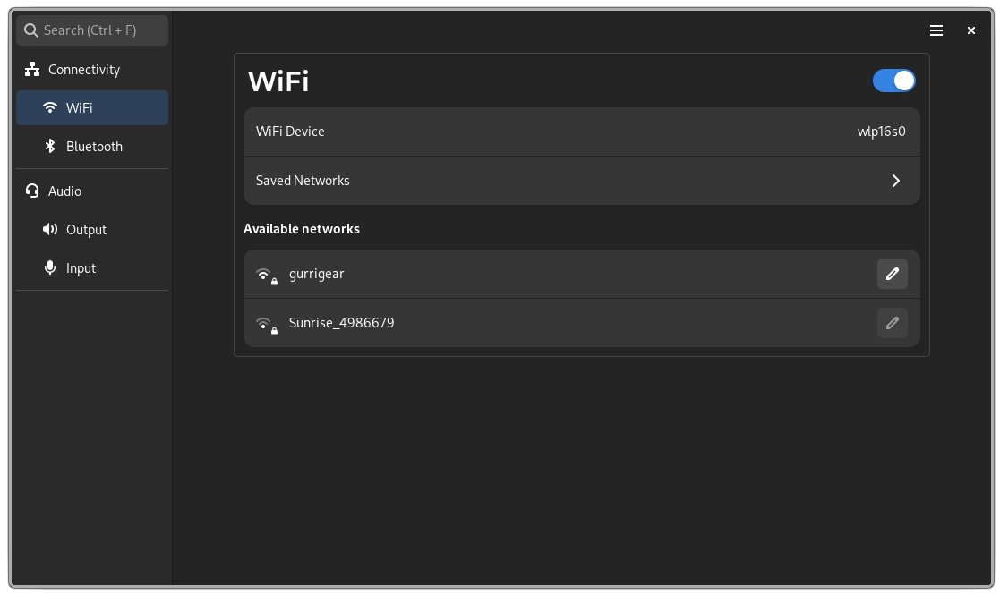
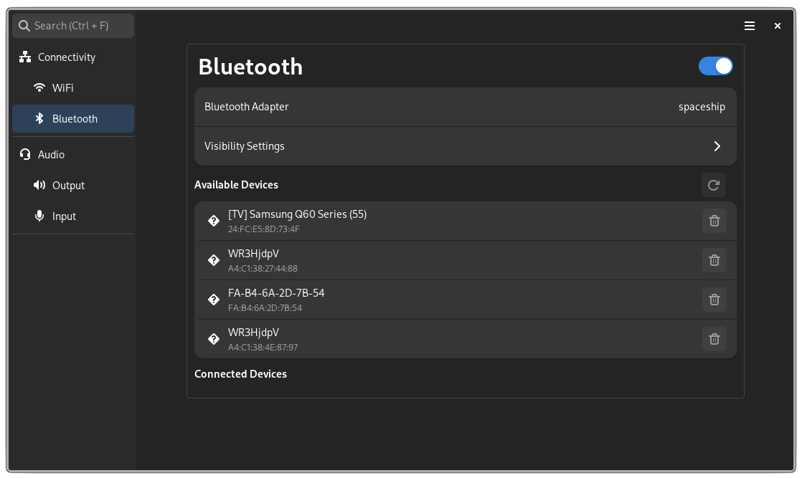

<div align = center>

# ReSet


A window manager/compositor agnostic settings application for Linux written in rust and gtk4.

</div>

## Features

- Bluetooth via bluez
- Audio via PulseAudio
- Wi-Fi via NetworkManager

## Screenshots

<div align = center>

### Audio



### Wi-Fi



### Bluetooth


</div>

## Plugins

ReSet features a plugin system by loading dynamic libraries for both the daemon and the ReSet graphical user interface.
A list of official plugins, installation guides and their documentation can be found at [ReSet-Plugins](https://github.com/Xetibo/ReSet-Plugins).

### Confirmation

In order for your plugins to load, you have to define them in `.config/reset/ReSet.toml`.
This is done to avoid loading of arbitrary plugins that might be placed within this folder by accident.

```toml
plugins = ["libreset_monitors.so", "libreset_keyboard_plugin.so"]
```

## Packaging

ReSet is available with the following packaging solutions:

### Flatpak

We are currently not published on flatpak due to issues with permissions.
This is being worked on...

Installation:
Download the flatpak package (reset.flatpak) from the release and install with the terminal.

```
flatpak install --user reset.flatpak
```

### Arch Package

<!-- AUR: -->

<!-- ```paru -S ReSet``` -->

Manually:
Download the package (ReSet-version-x86_64.pkg.tar.zst) from the releases tab and install it with pacman.

```
sudo pacman -U /path/to/reset
```

### Debian Package(Ubuntu 23.04 dependencies)

Download the package (ReSet.deb) from the releases tab and install it with apt.

```
sudo apt install ./path/to/reset
```

### NixOS/Home-manager

ReSet offers a flake with a home-manager module which you can use to declaratively install ReSet and plugins.
Here is an example configuration:

```nix
#inputs
reset.url = "github:Xetibo/ReSet";
reset-plugins.url = "github:Xetibo/ReSet-Plugins";

#installation and configuration
  programs.ReSet.enable = true;
  programs.ReSet.config.plugins = [
    inputs.reset-plugins.packages."x86_64-linux".monitor
    inputs.reset-plugins.packages."x86_64-linux".keyboard
  ];
  programs.ReSet.config.plugin_config = {
    #custom toml config
    Keyboard = {
      path = "/home/user/.config/reset/keyboard.conf";
    };
  };
```

### crates

```
cargo install reset
```

### Compiled Binary

The compiled binary is provided in the releases.

## Usage

Besides starting the application itself, a standalone daemon version ([ReSet-Daemon](https://github.com/Xetibo/ReSet-Daemon)) also exists, which is what provides the functionality for ReSet.\
It is therefore possible to use a different application as well for interacting with the daemon.

By default, the daemon is integrated into ReSet and is started automatically if no other daemon is found.

## Roadmap and Notes

- Accessibility Features
- Better Error handling
- Customizable shortcuts
- and more

### notes

This application was developed as a semester project/bachelor thesis for the Eastern Switzerland University of Applied Sciences.
